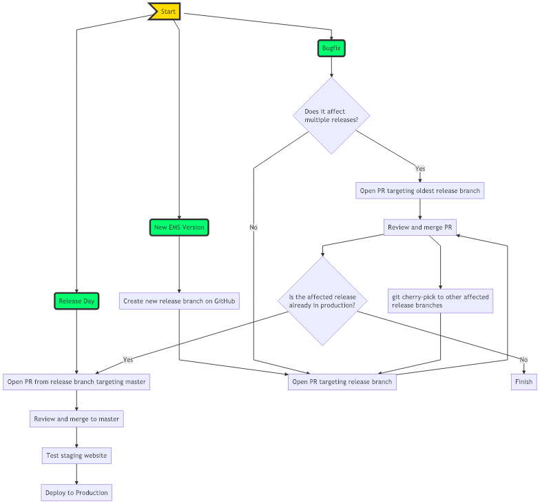

# Elastic Maps Service Landing Page

The Elastic Maps Landing Page is a previewer of the data of the Elastic Maps Service. It allows users to browse the data
that is available within EMS.

## Development

The page is designed as a single-page application. It loads the root manifest from EMS using a cross-domain call. This
is similar to how Kibana retrieves the manifest from EMS.

### Prerequisites

`yarn` is used as the dependency manager and script runner for this project. Ensure both `node` and `yarn` are installed on your system.

`webpack` is used for Javascript transpilation.

`grunt` is used for creating a distributable package of the app.

To use the recommended node version for running the dev and compile tasks, you can use 

> nvm use

### Running the page locally

#### Install dependencies

> yarn install

#### Start the babel compilation and watch task

> yarn dev

Keep this running. The javascript/css will be automatically recompiled when files change.

#### Open the page

Open `public/index.html`

You can run the page either from the file-system or any web-server.

## Packaging

To package the app, run the build script.

> yarn build

This script will put the relevant resources of the app in the `./build/release/**` folder.

If any intermediate tasks break before packaging, such as a javascript linting or compilation failure, the build-script will error out.
Fix the errors, and redeploy.

## Continuous Integration and Deployment
* Pull requests *MUST BE* submitted against the release being targeted (e.g. `v2`, `v6.6`), *not* `master`. PRs that target multiple releases (e.g. bug fixes) should target the oldest release (ex. `v2`) and `git cherry-pick` to newer releases (ex. `v6.6`).
* The code will be built automatically by Jenkins on every pull request using the `build.sh` script.
* Once merged, Jenkins will run `deployStaging.sh` script, which will place code into the staging bucket.
* Deploying to production requires manually triggering [this Jenkins job](https://kibana-ci.elastic.co/job/elastic+ems-landing-page+deploy/) to run the `deployProduction.sh` script. This will rsync files of the chosen branch from the staging bucket to the production bucket. To trigger, log in and click the "Build with Parameters" link. In the `branch_specifier` field enter the current release branch of the repository (ex. `v2`). 
* On the day of release, the respective release branch should be merged to `master` and deployed to production. This will update the default webpage (https://maps.elastic.co) to the current release.

## Development Flowchart
